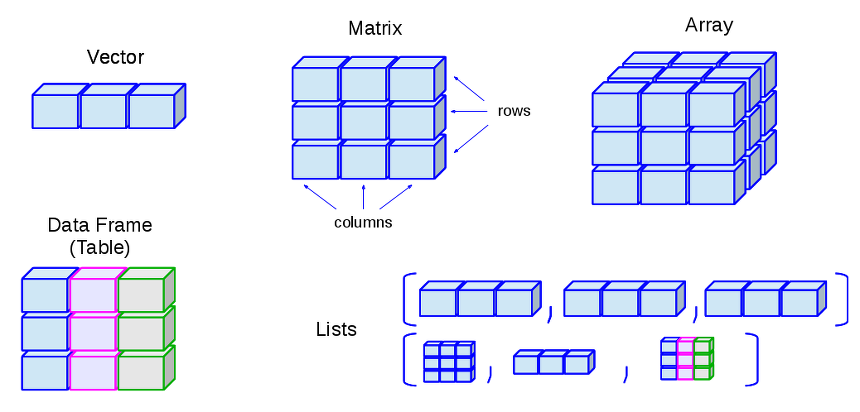
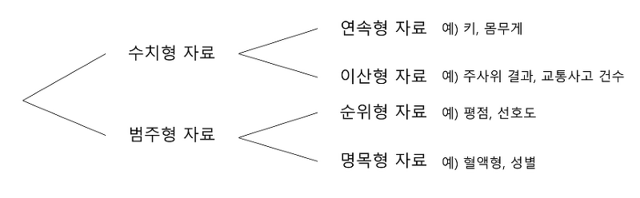
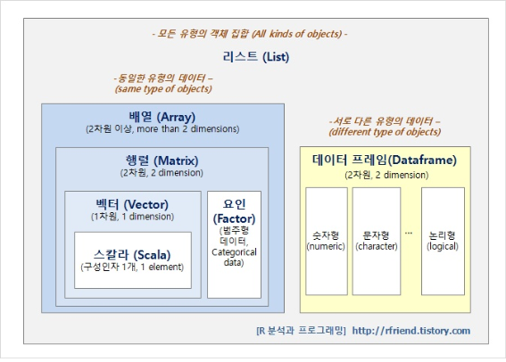

<br>

## 1. 벡터(Vector)
- 동일한 유형의 데이터로 구성된 1차원 데이터 구조.
- R에서 단일값(스칼라)은 원소가 하나인 벡터로 인식.

```{r}
# 벡터 표현법
v1 <- c(1,2,3)
v2 <- c("Hello", "world!")
```

## 2. 요인(Factor)
- 범주형 데이터
  - 데이터가 사전에 정해진 특정 유형으로 분류되는 경우.
  - 사전에 정해진 특정 유형을 레벨이라고 함.
  - 명목형과 순서형으로 구분.
    - 명목형: 값들 간 크기 비교가 불가한 경우(성별)
    - 순서형: 대, 중, 소와 같이 값에 순서를 둘 수 있는 경우



```{r}
# 요인 표현법
F1 <- factor(c("좋다","보통이다","싫다"),level=c("좋다","보통이다","싫다"))
F1
```

## 3. 행렬(Matrix)
- 동일한 유형의 2차원 데이터 구조(행과 열)
- R에서는 차원을 가진 벡터로 인식.

```{r}
M1 <- matrix(1:9, nrow = 3)
M1
```

## 4. 배열(Array)
- 2차원 데이터 구조인 행렬을 n차원 데이터구조로 확장한 데이터 구조.

```{r}
# 배열 표현법
A1 <- array(data = 1:24, dim = c(4,3,2))
A1
```

## 5. 데이터프레임(DataFrame)
- 데이터 유형에 관계없는 2차원 데이터구조.
- 엑셀 스프레드 시트와 같은 형태.

```{r}
# 데이터프레임 표현법
D1 <- c(1,2,3)
D2 <- c("A", "B", "C")
D3 <- data.frame(D1,D2)
```

## 6. 리스트(List)
- 데이터 구조에 관계없이 데이터들을 모두 묶은 객체.
- (키,값)형태의 데이터를 담는 연관배열이다.

```{r}
L1 <- list(v1, F1, M1, A1, D3)
L1
L2 <- list(x = 1:4, y = c("A", "B"))
L2$y
```



