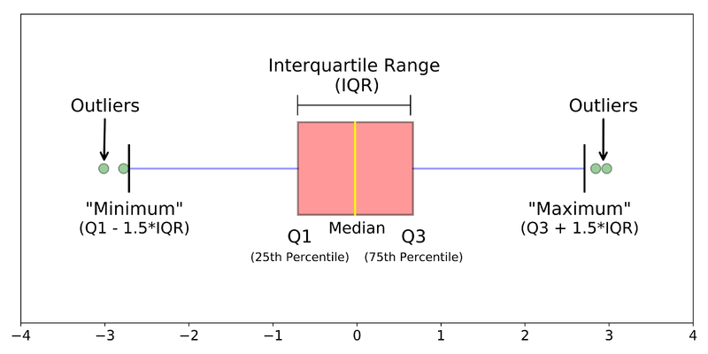

## 결측치 찾기

- 결측치의 의의
  - 누락된 값, 비어있는 값, 즉 공란을 말한다
  - 결측치가 있으면 함수가 적용되지 않거나 분석 결과가 왜곡되는 결과가 발생
  - 결측치를 제거 한 후 분석 실시
  - 표기법 : 대문자 NA(따옴표 없음)
    - Not Available
    
```{r}
df <- data.frame(sex = c("M", "F", NA, "M", "F"), score = c(5, 4, 3, 4, NA))

df
```

```{r}
# 결측치 확인
is.na(df)

```

```{r}
# 결측치 빈도 출력
table(is.na(df))

# 각 변수별로 결측치 확인
table(is.na(df$sex))

table(is.na(df$score))
```

```{r}
# 결측치가 포함된 상태로 분석
mean(df$score)

sum(df$score)
```

## 결측치 제거하기

```{r}
# dplyr 패키지 로드
library(dplyr)
```

```{r}
# score가 NA인 데이터만 출력
df %>% filter(is.na(score))

# score가 결측치가 아닌 데이터만 출력
# ! : 부정(not)
df %>% filter(!is.na(score))

```

```{r}
# 결측치 제외한 데이터로 분석하기
df_nomiss <- df %>% filter(!is.na(score))

mean(df_nomiss$score)

sum(df_nomiss$score)

```

```{r}
# 여러 변수에 동시에 결측치가 없는 데이터 출력하기
# score, sex 결측치 제외
df_nomiss <- df %>% filter(!is.na(score) & !is.na(sex))

df_nomiss
```

```{r}
# 결측치가 하나라도 있으면 제거
# 모든 변수에 결측치가 없는 데이터 추출
# 현업에서는 분석에 사용 가능한 행까지 지나치게 제거될 가능성이 있어서 비추천
df_nomiss2 <- na.omit(df)
df_nomiss2


```

## 함수의 결측치 제외 기능

```{r}
# 결측치를 제외한 평균
mean(df$score, na.rm = T)

sum(df$score, na.rm = T)

?mean
```

```{r}
exam <- read.csv("csv_exam.csv")
exam[c(3, 8, 15), "math"] <- NA
head(exam)

# 평균
exam %>% 
  summarise(mean_math = mean(math))

# 결측치 제외하고 계산한 평균
exam %>% 
  summarise(mean_math = mean(math, na.rm = T),
            sum_math = sum(math, na.rm = T),
            median_math = median(math, na.rm = T))


```

## 결측치 대체하기

- 데이터가 적고, 결측치가 많은 경우. 모든 결측치 데이터를 제외하면 데이터의 손실이 너무 크다

- 대안 : 다른 값 채워넣기 

### 결측치 대체법

- 대표값(평균, 최빈값 등)으로 일괄대체

- 통계분석 기법 적용, 예측값을 추청해서 대체 

```{r}
# 평균값으로 대체하기
mean(exam$math, na.rm = T)

# math 가 NA면 평균으로 대체
exam$math <- ifelse(is.na(exam$math), 55, exam$math)
  
table(is.na(exam$math))

head(exam)
```

## mpg데이터를 이용합 실습

```{r}
# mpg데이터에 결측치 생성
mpg <- as.data.frame(ggplot2::mpg)

mpg[c(65, 124, 131, 153, 212), "hwy"] <- NA

table(is.na(mpg$hwy))
```

*요구사항* : drv(구동방식)별로 hwy(고속도로 연비) 평균이 어떻게 다른지 알아보려한다.

*분석계획* : <br>
1. 분석에 앞서 결측치 확인<br>

2. 구동방식별 hwy평균을 구하기.

```{r}
mpg["drv"] <- NA
table(is.na(mpg$drv))

mpg_drv <- mpg %>% group_by(drv) %>% select(drv, hwy)
mpg_drv


```

# answer
```{r}
# ver1
mpg %>% 
  filter(!is.na(hwy)) %>% 
  group_by(drv) %>% 
  summarise(mean_hwy = mean(hwy))

# ver2
mpg %>% 
  group_by(drv) %>% 
  summarise(mean_hwy = mean(hwy, na.rm =T))
```

## 이상치 정제

- 이상치(Outlier)의 의의

  - 정상 범주에서 크게 벗어난 값
  
  - 데이터 수집 과정에서의 오류 또는 극단적인 값
  
  - 이상치 포함 시 분석 결과가 왜곡됨

| 이상치 종류 | 예 | 해결방법 |
| :-- | :-- | :-- |
| 존재할 수 없는 값 | 성별 변수에 3 | 결측 처리 |
| 극단적인 값 | 변수에 200 | 정상범위 기준 정해서 결측 처리 |

```{r}
# 존재할 수 없는 값 제거
df_outlier <- data.frame( sex = c(1, 2, 1, 3, 2 ,1),
                          score = c(5, 4, 3, 4, 2, 6))
df_outlier
```

```{r}
# 이상치 확인하기 
table(df_outlier$sex)

table(df_outlier$score)
```

```{r}
# sex 가 3이면 NA 할당
df_outlier$sex <- ifelse(df_outlier$sex == 3, NA, df_outlier$sex)

df_outlier

# score 가 1 ~ 5가 아니면 NA 할당
df_outlier$score <- ifelse(df_outlier$score > 5, NA, df_outlier$score)

df_outlier

```

```{r}
# 변환된 결측치를 제외하고 분석
df_outlier %>% 
  filter(!is.na(sex) &
           !is.na(score)) %>% 
  group_by(sex) %>% 
  summarise(mean_score = 
              mean(score))
```

- 극단치
  - 정상범위의 기준을 정해서 이를 벗어나면 결측 처리
  
| 판단기준 | 예 |
| :-- | :-- |
| 논리적 판단 | 성인 몸무게 40KG ~ 150KG 벗어나면 극단치 |
| 통계적 판단 | 상하위 0.3% 또는 상자그림에서 1.5IQR 벗어나면 극단치 |



```{r}
boxplot(mpg$hwy)

boxplot(mpg$hwy)$stats
# 상자 그림 통계치 출력(아래쪽 극단치 경계, 1사분위수, 중앙값, 3사분위수, 위쪽 극단치 경계)
```

```{r}
# 12 ~ 37 벗어나면 NA 할당
mpg$hwy <- ifelse(mpg$hwy < 12 | mpg$hwy > 37, NA, mpg$hwy)

table(is.na(mpg$hwy))

# 극단치 정제 후 데이터 분석
mpg %>% 
  group_by(drv) %>% 
  summarise(mean_hwy = mean(hwy, na.rm = T))
```

## mpg데이터 분석 연습
**분석계획**: <br>
drv, cty 변수에 이상치 할당<br>
1. drv에 이상치가 있는지 확인한 뒤, 이상치를 결측 처리한 후 이상치가 잘 처리되었는지 확인.<br>

2. 상자 그림을 이용해 cty에 이상치가 있는지 확인하고 상자 그림 통계치에서 정상범위를 벗어난 값을 결측처리. 그 후 다시 상자그림을 만들어 이상치가 있는지 확인.<br>

3. 이상치를 제외한 다음 drv 별로 cty 평균이 어떻게 다른지 확인.

```{r}
mpg <- as.data.frame(ggplot2::mpg)
mpg[c(10, 14, 58, 93), "drv"] <- "k"
mpg[c(29, 43, 129, 203), "cty"] <- c(3, 4, 39, 42)

table(mpg$drv)
table(mpg$cty)

drv_outlier <- mpg$drv
drv_outlier <- ifelse(mpg$drv == "k" , NA, drv_outlier)
drv_outlier
table(drv_outlier)

boxplot(mpg$cty)
table(mpg$cty)

mean(mpg$cty)
cty_outlier <- mpg$cty
cty_outlier <- ifelse(mpg$cty > 26 | mpg$cty < 9, NA, cty_outlier)
table(cty_outlier)
boxplot(cty_outlier)


drv <- drv_outlier
mpg %>% group_by(drv) %>%
  summarise(mean_cty = mean(cty, na.rm = T))


```

# answer
```{r}
# 1-1. 이상치가 있는지 확인
table(mpg$drv)
```

```{r}
# 1-2. 이상치를 결측 처리한 후 이상치가 잘 처리되었는지 확인
mpg$drv <- ifelse(mpg$drv %in% c("4", "f", "r"), mpg$drv, NA)

table(mpg$drv)
```

```{r}
# 2-1. 상자 그림을 이용해 cty에 이상치가 있는지 확인
boxplot(mpg$cty)$stats

# 2-2. 정상 범위를 벗어난 값을 결측처리.
mpg$cty <- ifelse(mpg$cty < 9 | mpg$cty > 26, NA, mpg$cty)

boxplot(mpg$cty)
```

```{r}
# 3. 이상치를 제외한 다음 drv별로 cty평균이 어떻게 다른지 확인
mpg %>% 
  filter(!is.na(drv) & !is.na(cty)) %>% 
  group_by(drv) %>% summarise(mean_cty = mean(cty))
```


