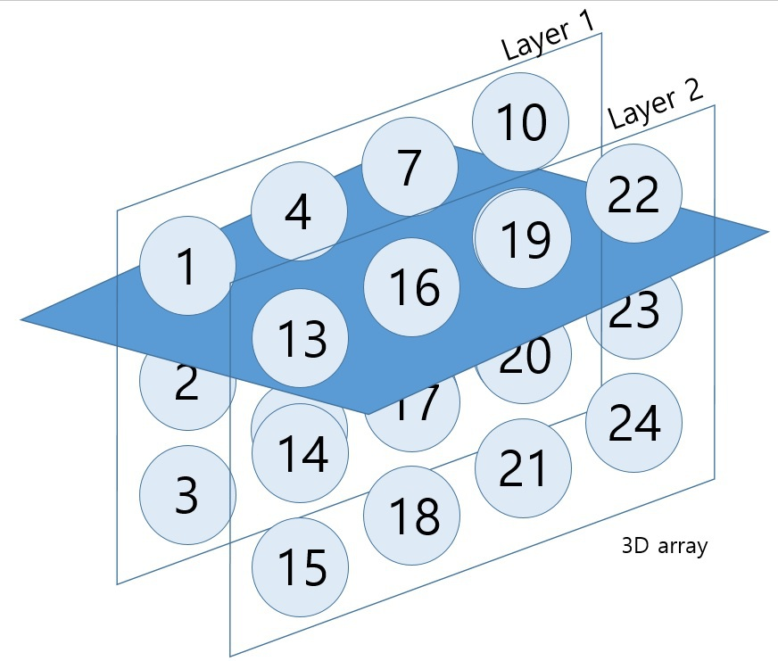

# apply()

- 함수를 특정 단위로 쉽게 적용 할 수 있도록 지원하는 함수
  - apply 계열 함수들의 차이점 : 입력데이터의 종류, 결과의 형태, 연산 단위
  
## apply함수의 문법
- apply(함수를 적용할 대상, 방향, 함수)

```{r}
a <- array(1:12, dim = c(3, 4))
a
```

## 적용방향
- 1 : 가로
- 2 : 세로


```{r}
apply(a, 1, max)

apply(a, 2, max)
```

```{r}
# 적용할 함수 작성하기
f <- function(vec){
  max(vec)^2 + 3
}

apply(a, 1, f)

```

## 3차원 array에 적용




```{r}
a <- array(1:24, dim = c(3, 4, 2))
a
```

```{r}
apply(a, 1, max)

apply(a, 2, max)
```

```{r}
a <- array(sample(24,24), dim = c(3, 4, 2))
a

apply(a, 1, max)

apply(a, 2, max)

apply(a, 3, max) # 레이어별로 적용되므로 레이어에서 큰 값이 나오게 된다

```

```{r}
iris_sample <- iris[1:10, 1:4]
iris_sample

a[2, 4, 1] <- NA
a[2, 1, 1] <- NA

apply(a, 1, mean)
apply(a, 2, mean)

apply(a, 1, mean, na.rm = T)
apply(a, 2, mean, na.rm = T)
```

# lapply
- list + apply
- 실행결과가 list형태로 출력

```{r}
lapply(a, function(x){x*2})
```

# sapply
- lapply 에서 사용자 편의성을 고려한 함수
- 기본적으로는 벡터형태로 출력
  - 입력데이터가 리스트 형태인 경우 리스트로 출력
  - simplify = F인 경우 리스트 형태로 출력

```{r}
sapply(a, function(x){x*2}, simplify = F)

sapply(a, function(x){x*2}, simplify = F)
```


