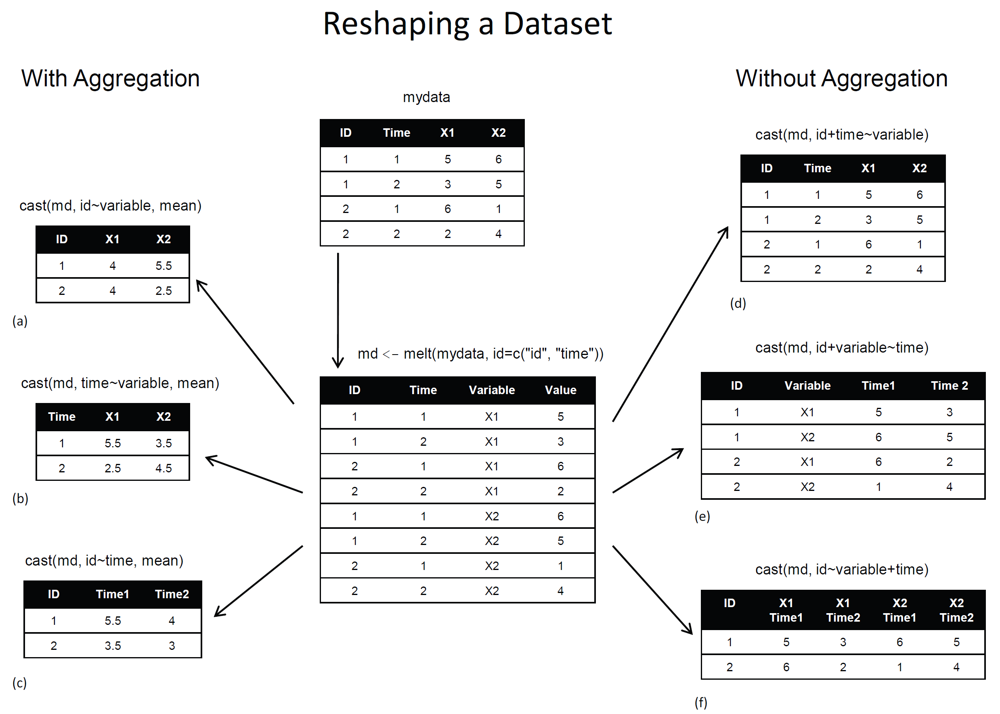

# reshape

- melt()
  - 원데이터 형태로 만드는 함수
  - 변수를 데이터로 바꿈
  - 일반적으로 모델링에 적합
  - melt(data, id = ...)
  
- cast()
  - 요약 형태로 만드는 함수
  - 데이터를 변수로 바꿈
  - 일반적으로 그래프 시각화에 적합
  - cast(data, formula = ...~ variable, fun)



```{r}
head(airquality)
```

- airquality 데이터 : 153일 동안의 공기 질 측정 데이터 

*변수*
- Ozone : 평균 오존량
- Solar.R : 태양 복사
- wind : 평균 풍속
- Temp : 최대 온도
- Month : 월
- Day : 일

```{r}
#install.packages("reshape")
library(reshape)
```

```{r}
# melt 함수
apm <- melt(airquality, id = c("Month", "Day"), na.rm = T)

head(apm)
```

```{r}
# cast 함수
#              세로 가로 값
head(cast(apm, Day~Month~variable))
tail(cast(apm, Day~Month~variable))

```

```{r}
head(cast(apm, Month+Day~variable))

head(cast(apm, Month+variable~Day))

head(cast(apm, Month~variable+Day))
```

```{r}
head(cast(apm, Month~variable, mean))

head(cast(apm, Day~variable, mean))

head(cast(apm, Month~Day, mean))
```


